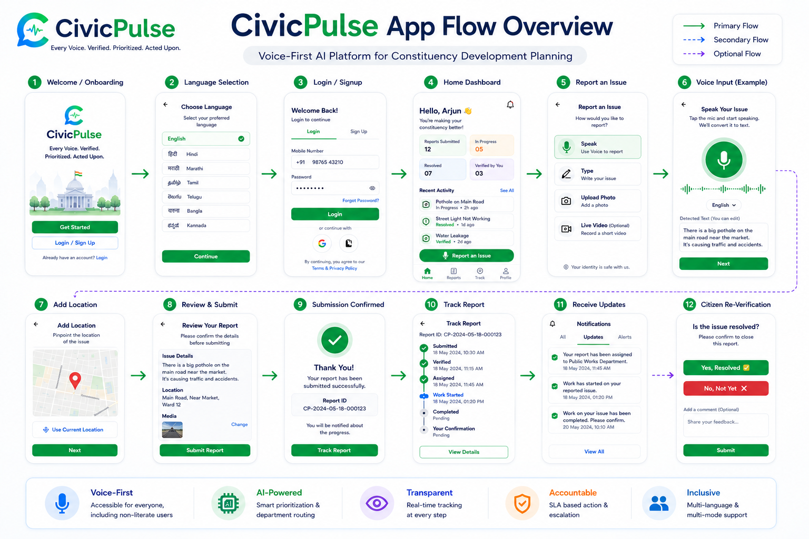

# CivicPulse 🏛️ - Constituency Planning & Citizen Reporting Platform

[](LICENSE)
[](https://flutter.dev)
[](https://fastapi.tiangolo.com)
[](https://www.meity.gov.in)
[](https://developeryatin.github.io/CivicPulse/)

🌐 **Live Website:** [https://developeryatin.github.io/CivicPulse/](https://developeryatin.github.io/CivicPulse/)

**CivicPulse** is an AI-powered civic operating layer connecting rural and urban citizens directly with their elected representatives (MLAs & MPs). It bridges the digital divide using ambient voice inputs in local languages, automates representative briefing via WhatsApp daily digests, and utilizes decentralized verification (ISRO Sentinel-2 satellites & community geofencing) to keep public infrastructure reporting fast, reliable, and transparent.

---

## 📸 Platform Overview

Below is the conceptual architecture blueprint for the CivicPulse ecosystem:



---

## 🏗️ Repository Architecture (Monorepo)

CivicPulse is organized as a unified monorepo to enable concurrent development of mobile clients, web administration portals, and backend endpoints:

```
CivicPulse/
├── README.md                     # Monorepo documentation (This file)
├── tech_stack.md                 # Product-level technology blueprints
├── .gitignore                    # Shared version-control exclusions
├── assets/                       # Static media, workflow diagrams & mock assets
│   └── overview.png              # System design overview schematic
│
├── frontend/                     # Cross-platform Client Hub (Flutter & Dart)
│   ├── .fvm/                     # Flutter Version Management (Version pinned to 3.35.7)
│   ├── pubspec.yaml              # App configuration and dependencies
│   ├── lib/
│   │   ├── main.dart             # Unified entrypoint detecting profile roles
│   │   ├── core/                 # Shared resources, theme, constants
│   │   └── features/             # Feature-first modules
│   │       ├── citizen_client/   # Voice reporting & Bhashini integrations
│   │       ├── mla_tracker/      # Representative ticket manager & tracker
│   │       ├── panchayat_sync/   # Local database & Aadhaar SHA rate-limiter
│   │       └── web_dashboard/    # MP administration analysis charts
│
└── backend/                      # Async API Gateway (Python FastAPI)
    ├── requirements.txt          # Python dependencies (SQLAlchemy, GeoAlchemy2)
    ├── Dockerfile                # Production spatial deployment container config
    ├── README.md                 # Developer setup & database setup guide
    └── app/
        ├── main.py               # Main application entry point
        ├── core/                 # Settings, DB session & security configs
        ├── api/                  # Routed endpoints (Complaints, Translate, Verify)
        └── services/             # Integrations (Bhashini translate, ISRO Sentinel)
```

---

## 🛠️ Technology Integration Blueprint

### 1. Interaction Layer (Frontend & Clients)
*   **Flutter & Dart (Mobile):** Pinned to SDK version `3.35.7` to ensure compilation consistency. Used to deploy low-resource mobile clients (Citizen client, MLA ward tracker, Gram Panchayat offline panel).
*   **Flutter & Dart (Web):** Deploys responsive, high-fidelity analytics dashboards for MP administrative offices, sharing the same UI codebase.
*   **SIP/VoIP IVR Protocols:** Direct phone-line interfaces to allow speech inputs without smartphones (supporting zero-literacy reporting).

### 2. Processing Layer (AI & Speech)
*   **Bhashini API:** Official translation framework to transliterate/validate citizen inputs across 22 official Indian languages.
*   **Whisper STT:** Fine-tuned speech-to-text models to process audio inputs with noisy background levels.
*   **LLM Pipelines (Gemini/Claude):** Summarizes ticket lists and compiles text digests automatically sent to representatives' phones.

### 3. Verification Layer (GIS & Ledger)
*   **PostgreSQL & PostGIS:** Spatial database engine running clustering metrics to flag identical complaint logs within geofences.
*   **ISRO Sentinel-2:** Spatial analytics checking NDVI/NDWI visual band variations to cross-validate major physical infrastructure claims.
*   **SHA-256 Aadhaar Hash:** Anonymized client identifier check in strict compliance with the **DPDP Act 2023** to limit complaints (Max 3 submissions per user monthly).

---

## 🚀 Getting Started

To explore the projects individually, navigate to their respective subdirectories:

1.  **Frontend Setup:** Refer to instructions in the [frontend/README.md](file:///Users/adda247/Desktop/yatin%20website/CivicPulse/frontend/README.md).
2.  **Backend Setup:** Refer to instructions in the [backend/README.md](file:///Users/adda247/Desktop/yatin%20website/CivicPulse/backend/README.md).
